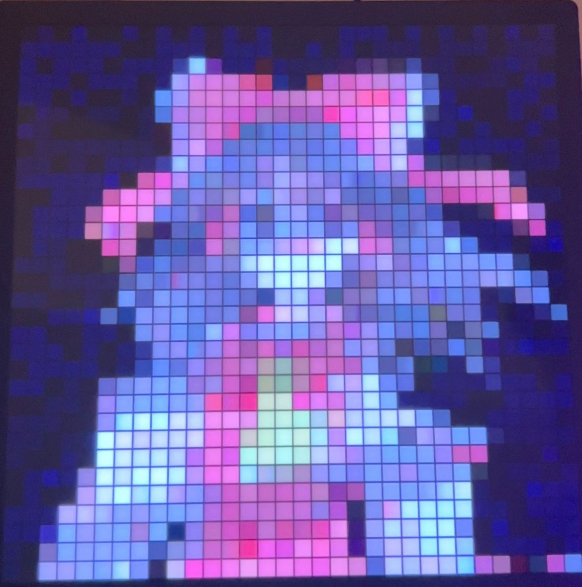
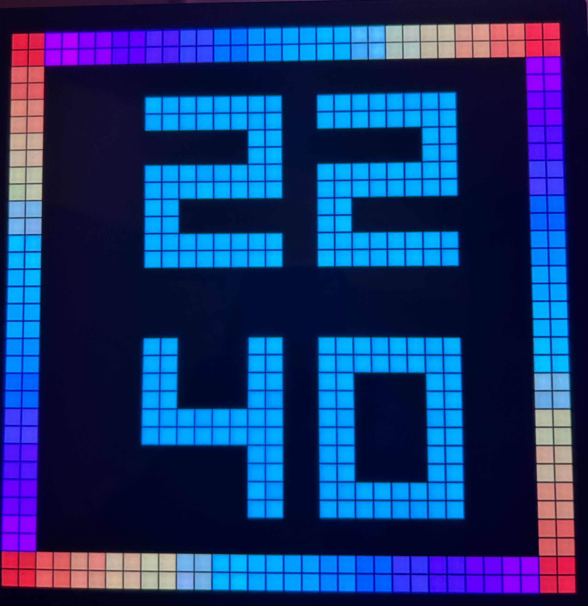

    

<h1 align="center">Pixelmatrix</h1>

Control your iDotMatrix.

# What's iDotMatrix?
iDotMatrix is a Programmable Pixel iDotMatrix LED Pixel Display.

    

More details on [YouTube](https://www.youtube.com/watch?v=r2M9qa97ZQA).

# Usage
Run `--help` in cli.

Bluetooth required! Remember to switch on bluetooth.

# License
MIT License 2024-PRESENT @Vincent-the-gamer